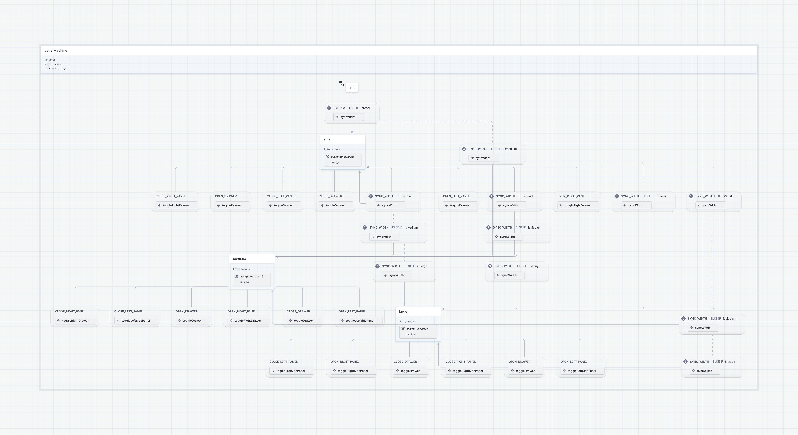

# State machine example (feat. Xstate)

State machine을 이용한 상태 관리 예시입니다.

[Xstate](https://stately.ai/docs/xstate)를 사용하였습니다.

## 예시 : 패널 상태 관리

반응형 좌우 패널 및 Drawer들의 상태를 관리합니다.

### 정책

- sidepanel은 좌우 하나씩 내용이 들어간다. string이 들어가있으면 open, 무엇이 들어가는지는 string으로 판단된다.
- drawer는 한번에 하나만 나타날 수 있다.

- state: small
  - sidePanel 사용 불가능
  - drawer는 하나만 가능

- state: medium
  - sidePanel 중에 left는 사용 불가, right는 사용
  - drawer는 하나만 가능

- state: large
  - sidePanel 양쪽 사용
  - drawer는 하나만 가능

- state 변경될 때: sidePanel과 drawer는 모두 닫힘.

### 구현한 상태머신 다이어그램

[상태머신 다이어그램](https://stately.ai/registry/editor/ac5bf91c-f9c7-4796-9bdb-90f38a5ca6a1?machineId=47d2f8b4-f138-4a7f-97c1-d55962cab50c&mode=Design)

